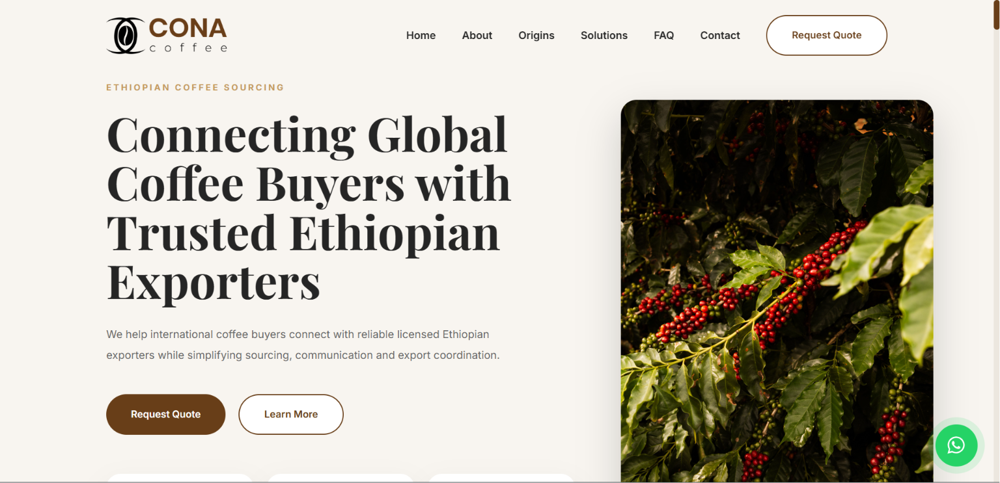

# ☕ Cona Coffee

A modern, responsive coffee sourcing website built for **Cona Coffee**, connecting international coffee buyers with trusted Ethiopian coffee exporters.

## 🌍 Live Demo

**Live Website:** https://cona-coffee.vercel.app/

## 📸 Preview


## 📖 About

Cona Coffee is a professional business website designed for an Ethiopian coffee sourcing agency. It showcases Ethiopian coffee origins, sourcing services, and provides a simple way for international buyers to submit inquiries and connect with trusted exporters.

## ✨ Features

- Responsive design for desktop and mobile
- Modern coffee-inspired UI
- Smooth scrolling
- Animated sections using Framer Motion
- Coffee origins showcase
- Services section
- FAQ section
- Buyer inquiry/contact form
- Floating WhatsApp button
- Back-to-top button

## 🛠️ Built With

- React
- Vite
- JavaScript
- CSS3
- Framer Motion
- Lucide React
- React Icons
- Web3Forms

## 📁 Project Structure

```text
src/
├── components/
├── pages/
├── styles/
├── App.jsx
└── main.jsx
```

## 🚀 Getting Started

### Clone the repository

```bash
git clone https://github.com/Nahom-Getnet/cona-coffee.git
```

### Install dependencies

```bash
npm install
```

### Start the development server

```bash
npm run dev
```

## 🎯 Purpose

This project was developed as a real-world business website for an Ethiopian coffee sourcing agency, providing a professional online presence and making it easier for international buyers to connect with local coffee exporters.

## 👨‍💻 Author

**Nahom Getnet**
